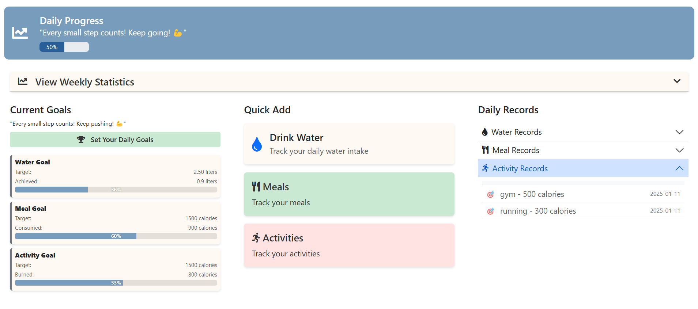
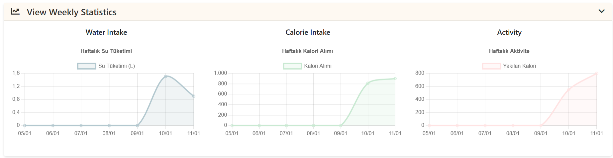

# Health Tracker

Health Tracker is a web application that allows users to track their daily health goals. Users can set goals for drinking water, eating, and physical activities, and view how much progress they have made towards achieving these goals. This project is developed using Python and Flask, with the frontend using HTML, CSS, and Bootstrap.

## Features

- **Water Goal**: Track the amount of water consumed daily.
- **Calorie Goal**: Track the number of calories consumed daily.
- **Activity Goal**: Track the number of calories burned and the activities performed.
- **Goal Progress**: Display the percentage of completion for each goal.
- **Personal Motivation**: Display motivational messages to encourage users.
- **Daily and Weekly Updates**: The app updates each user's progress daily and tracks the weekly performance in a statistical graph.
- **Statistical Graphs**: Display daily and weekly health data in visually appealing statistical charts.

## Screenshots

### 1. Dashboard Overview (Top view showing water intake, calories burned, etc.)


### 2. Statistical Graphs (Graph displaying weekly progress)


## Technologies

- **Backend**: Python, Flask
- **Frontend**: HTML, CSS, Bootstrap, FontAwesome
- **Database**: MySQL (Instead of SQLite, MySQL is used in this project for handling database operations)

## Getting Started

You can clone this project to your local machine and run it in your local environment by following the steps below:

### Requirements

- Python
- Flask
- MySQL

### Installation

1. Clone this project from GitHub:

   ```bash
   git clone https://github.com/Asliikl/Health-Tracker.git
